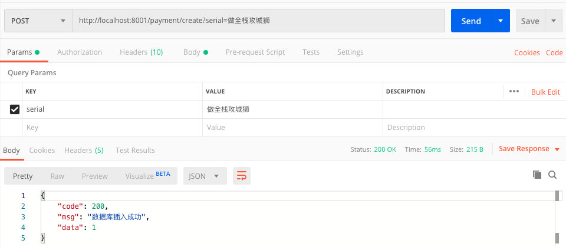
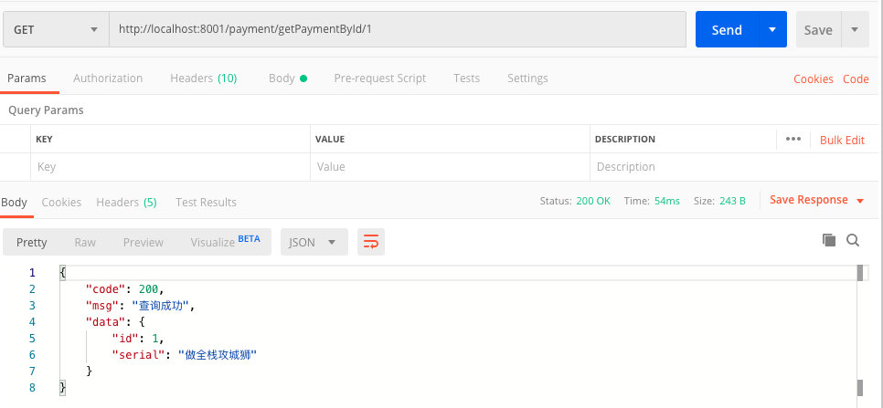
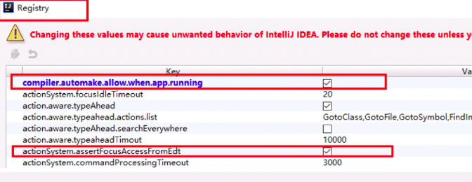
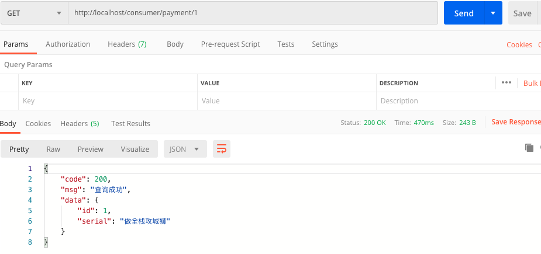
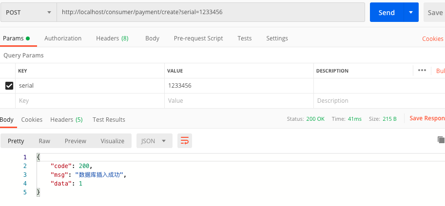
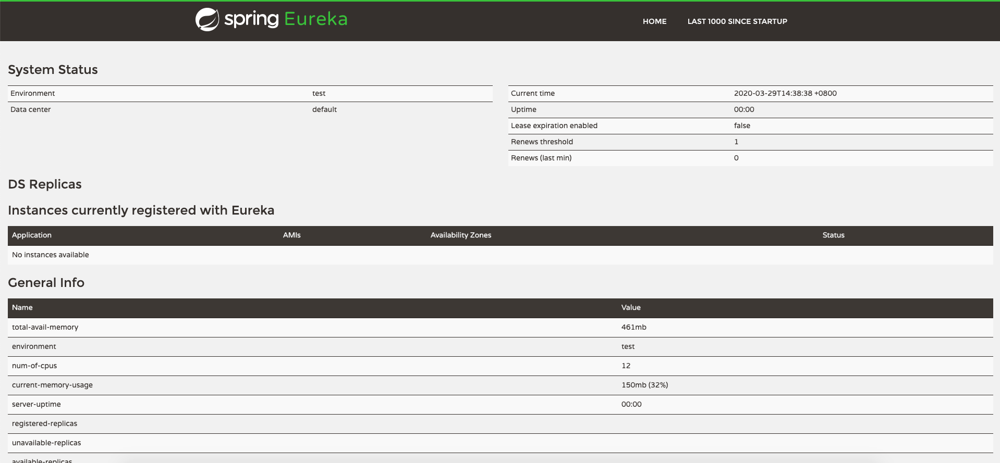

# spring-could-2020

spring cloud学习笔记，基于spring boot 2.新版本，集成Spring Cloud、Spring Cloud Alibaba相关微服务组件。

# 一、版本选择

## 1.1 Spring Boot版本选择

git源码地址：

http://github.com/spring-projects/spring-boot/releases/

2.0版本说明：

https://github.com/spring-projects/spring-boot/wiki/Spring-Boot-2.0-Release-Notes

> 官方强烈建议我们升级到2.x版本

查看spring boot最新版本:

https://spring.io/projects/spring-boot

## 1.2 Spring Cloud版本选择

官网地址：

https://spring.io/projects/spring-cloud

可通过官网查看最新版本。

## 1.3 spring boot和spring cloud依赖关系

官网地址：

https://spring.io/projects/spring-cloud#overview

可以找到spring boot对应的 spring cloud版本推荐。


也可访问：https://start.spring.io/actuator/info

获取更详细的依赖信息。

# 二、本项目使用版本

Spring Cloud：Hoxton.SR1

Spring Boot：2.2.RELEASE

Spring Alibaba Cloud：alibaba 2.1.0.RELEASE

java：1.8

Maven：3.5及以上

# 三、总体使用组件


# 四、创建父工程

1.新建普通maven工程

2.添加pom文件

```xml
<?xml version="1.0" encoding="UTF-8"?>
<project xmlns="http://maven.apache.org/POM/4.0.0"
         xmlns:xsi="http://www.w3.org/2001/XMLSchema-instance"
         xsi:schemaLocation="http://maven.apache.org/POM/4.0.0 http://maven.apache.org/xsd/maven-4.0.0.xsd">
    <modelVersion>4.0.0</modelVersion>

    <groupId>com.chengxiaoxiao.springcloud</groupId>
    <artifactId>spring-cloud-parent</artifactId>
    <version>1.0-SNAPSHOT</version>

    <!--统一管理jar包和版本-->
    <properties>
        <project.build.sourceEncoding>UTF-8</project.build.sourceEncoding>
        <maven.compiler.source>1.8</maven.compiler.source>
        <maven.compiler.target>1.8</maven.compiler.target>
        <junit.version>4.12</junit.version>
        <log4j.version>1.2.17</log4j.version>
        <lombok.version>1.16.18</lombok.version>
        <mysql.version>8.0.18</mysql.version>
        <druid.verison>1.1.16</druid.verison>
        <mybatis.spring.boot.verison>1.3.0</mybatis.spring.boot.verison>
    </properties>
    <dependencyManagement>
        <dependencies>
            <!--spring boot 2.2.2-->
            <dependency>
                <groupId>org.springframework.boot</groupId>
                <artifactId>spring-boot-dependencies</artifactId>
                <version>2.2.2.RELEASE</version>
                <type>pom</type>
                <scope>import</scope>
            </dependency>
            <!--spring cloud Hoxton.SR1-->
            <dependency>
                <groupId>org.springframework.cloud</groupId>
                <artifactId>spring-cloud-dependencies</artifactId>
                <version>Hoxton.SR1</version>
                <type>pom</type>
                <scope>import</scope>
            </dependency>
            <!--spring cloud alibaba 2.1.0.RELEASE-->
            <dependency>
                <groupId>com.alibaba.cloud</groupId>
                <artifactId>spring-cloud-alibaba-dependencies</artifactId>
                <version>2.2.0.RELEASE</version>
                <type>pom</type>
                <scope>import</scope>
            </dependency>
            <!-- MySql -->
            <dependency>
                <groupId>mysql</groupId>
                <artifactId>mysql-connector-java</artifactId>
                <version>${mysql.version}</version>
            </dependency>
            <!-- Druid -->
            <dependency>
                <groupId>com.alibaba</groupId>
                <artifactId>druid-spring-boot-starter</artifactId>
                <version>${druid.verison}</version>
            </dependency>
            <!-- mybatis-springboot整合 -->
            <dependency>
                <groupId>org.mybatis.spring.boot</groupId>
                <artifactId>mybatis-spring-boot-starter</artifactId>
                <version>${mybatis.spring.boot.verison}</version>
            </dependency>
            <!--lombok-->
            <dependency>
                <groupId>org.projectlombok</groupId>
                <artifactId>lombok</artifactId>
                <version>${lombok.version}</version>
            </dependency>
            <!--junit-->
            <dependency>
                <groupId>junit</groupId>
                <artifactId>junit</artifactId>
                <version>${junit.version}</version>
            </dependency>
            <!-- log4j -->
            <dependency>
                <groupId>log4j</groupId>
                <artifactId>log4j</artifactId>
                <version>${log4j.version}</version>
            </dependency>
        </dependencies>
    </dependencyManagement>

    <build>
        <plugins>
            <plugin>
                <groupId>org.springframework.boot</groupId>
                <artifactId>spring-boot-maven-plugin</artifactId>
                <configuration>
                    <fork>true</fork>
                    <addResources>true</addResources>
                </configuration>
            </plugin>
        </plugins>
    </build>

</project>
```

dependencyManagement节点是管理依赖版本号的一种方式。可以使子模块无需，添加版本号。dependencyManagement只是声明，并不添加依赖。以此达到统一版本处理。

父工程创建完成了，要先执行mvn:install将父工程发布到仓库，方便子工程继承。

# 五、REST基础微服务

## 5.1 微服务提供者

1.建module

2.改POM文件

```pom
<dependencies>
        <dependency>
            <groupId>org.springframework.boot</groupId>
            <artifactId>spring-boot-starter-web</artifactId>
        </dependency>
        <dependency>
            <groupId>org.springframework.boot</groupId>
            <artifactId>spring-boot-starter-actuator</artifactId>
        </dependency>
        <dependency>
            <groupId>org.mybatis.spring.boot</groupId>
            <artifactId>mybatis-spring-boot-starter</artifactId>
        </dependency>
        <dependency>
            <groupId>com.alibaba</groupId>
            <artifactId>druid-spring-boot-starter</artifactId>
        </dependency>
        <dependency>
            <groupId>mysql</groupId>
            <artifactId>mysql-connector-java</artifactId>
        </dependency>
        <dependency>
            <groupId>org.springframework.boot</groupId>
            <artifactId>spring-boot-starter-jdbc</artifactId>
        </dependency>
        <dependency>
            <groupId>org.springframework.boot</groupId>
            <artifactId>spring-boot-devtools</artifactId>
            <scope>runtime</scope>
            <optional>true</optional>
        </dependency>
        <dependency>
            <groupId>org.projectlombok</groupId>
            <artifactId>lombok</artifactId>
            <optional>true</optional>
        </dependency>
        <dependency>
            <groupId>org.springframework.boot</groupId>
            <artifactId>spring-boot-starter-test</artifactId>
        </dependency>

    </dependencies>
```

3.yml文件修改

```yml
server:
  port: 8001

spring:
  application:
    name: cloud-payment-service

  datasource:
    type: com.alibaba.druid.pool.DruidDataSource
    driver-class-name: com.mysql.cj.jdbc.Driver
    url: jdbc:mysql://192.168.4.188:3306/cloud2020?characterEncoding=utf8&useSSL=false&serverTimezone=UTC&rewriteBatchedStatements=true
    username: root
    password: 123456

mybatis:
  mapper-locations: classpath:mapper/*.xml
  type-aliases-package: com.chengxiaoxiao.cloud.entities #所有entity别名所在包
```

添加数据库：

```sql
DROP TABLE IF EXISTS `payment`;
CREATE TABLE `payment` (
  `id` bigint(20) NOT NULL AUTO_INCREMENT,
  `serial` varchar(200) DEFAULT NULL,
  PRIMARY KEY (`id`)
) ENGINE=InnoDB DEFAULT CHARSET=utf8;
```

添加entities

```java
@Data
@AllArgsConstructor
@NoArgsConstructor
public class Payment implements Serializable {
    private Long id;
    private String serial;
}
```

添加CommonResult

```code
@Data
@AllArgsConstructor
@NoArgsConstructor
public class CommonResult<T> {
    private Integer code;
    private String msg;
    private T data;
}
```

添加Dao层

```java
@Mapper
public interface PaymentDao {
    int create(Payment payment);

    Payment getPaymentById(@Param("id") Long id);
}
```

添加service

```java
@Service
public class PaymentServiceImpl implements PaymentService {

    @Resource
    private PaymentDao paymentDao;

    @Override
    public int create(Payment payment) {
        return paymentDao.create(payment);
    }

    @Override
    public Payment getPaymentById(Long id) {
        return paymentDao.getPaymentById(id);
    }
}

```

添加mapper.xml文件

```xml
<?xml version="1.0" encoding="UTF-8" ?>
<!DOCTYPE mapper PUBLIC "-//mybatis.org//DTD Mapper 3.0//EN" "http://mybatis.org/dtd/mybatis-3-mapper.dtd" >
<mapper namespace="com.chengxiaoxiao.cloud.dao.PaymentDao">
    <insert id="create" parameterType="Payment" useGeneratedKeys="true" keyProperty="id">
        insert into payment(serial) values(#{serial})
    </insert>


    <resultMap id="BaseResultMap" type="com.chengxiaoxiao.cloud.entities.Payment">
        <id column="id" property="id" jdbcType="BIGINT"/>
        <id column="serial" property="serial" jdbcType="VARCHAR"/>
    </resultMap>

    <select id="getPaymentById" parameterType="Long" resultMap="BaseResultMap">
        select * from payment where id=#{id}
    </select>
</mapper>
```


postman测试





## 5.2 配置热部署

1.添加依赖

```maven
        <dependency>
            <groupId>org.springframework.boot</groupId>
            <artifactId>spring-boot-devtools</artifactId>
            <scope>runtime</scope>
            <optional>true</optional>
        </dependency>
```

2.添加plugin，放入父工程

```
    <build>
        <plugins>
            <plugin>
                <groupId>org.springframework.boot</groupId>
                <artifactId>spring-boot-maven-plugin</artifactId>
                <configuration>
                    <fork>true</fork>
                    <addResources>true</addResources>
                </configuration>
            </plugin>
        </plugins>
    </build>
```

3.开启自动编译


help->find action ->registry



## 5.3 微服务消费者

1.建立module

2.添加pom依赖

```pom
<dependency>
            <groupId>org.springframework.boot</groupId>
            <artifactId>spring-boot-starter-web</artifactId>
        </dependency>
        <dependency>
            <groupId>org.springframework.boot</groupId>
            <artifactId>spring-boot-starter-actuator</artifactId>
        </dependency>
        <dependency>
            <groupId>org.springframework.boot</groupId>
            <artifactId>spring-boot-devtools</artifactId>
            <scope>runtime</scope>
            <optional>true</optional>
        </dependency>
        <dependency>
            <groupId>org.projectlombok</groupId>
            <artifactId>lombok</artifactId>
            <optional>true</optional>
        </dependency>
        <dependency>
            <groupId>org.springframework.boot</groupId>
            <artifactId>spring-boot-starter-test</artifactId>
        </dependency>
```

3.建yml

```java
server:
  port: 80
spring:
  application:
    name: cloud-consumer-order
```

4.添加启动类

```
@SpringBootApplication
public class OrderMain80 {
    public static void main(String[] args) {
        SpringApplication.run(OrderMain80.class, args);
    }
}
```

5.写controller实现调用微服务提供者，实现对其远程调用

使用RestTemplate是一种简单便捷的访问restful的服务类，用它可以远程调用url。

官网地址：https://docs.spring.io/spring-framework/docs/5.2.2.RELEASE/javadoc-api/org/springframework/web/client/RestTemplate.html

添加config，注入进入工程。

```
@Configuration
public class ApplicationContextConfig {
    @Bean
    public RestTemplate getRestTemplate(){
        return new RestTemplate();
    }
}
```

> RestTemplate:主要包括getforObject/getForEntity。entity返回了更多的信息，如请求头之类的。forObject主要返回响应体

controller

```
@RestController
public class PaymentController {

    private final String PAYMENT_URL = "http://localhost:8001";
    @Resource
    private RestTemplate restTemplate;

    @PostMapping("/consumer/payment/create")
    public CommonResult create(Payment payment) {
        return restTemplate.postForObject(PAYMENT_URL + "/payment/create", payment, CommonResult.class);
    }

    @GetMapping("/consumer/payment/{id}")
    public CommonResult getPayment(@PathVariable("id") Long id) {
        return restTemplate.getForObject(PAYMENT_URL + "/payment/getPaymentById/" + id, CommonResult.class);
    }
}
```

测试





# 六、工程重构

目前工程中entiyies在每个module中都需要重新建立一份，而这些信息，是通用的。完全可以提出来新建立一个module，让所有module依赖此公用module。

新建cloud-api-common module

添加依赖

```
    <dependencies>
        <dependency>
            <groupId>org.springframework.boot</groupId>
            <artifactId>spring-boot-devtools</artifactId>
            <scope>runtime</scope>
            <optional>true</optional>
        </dependency>
        <dependency>
            <groupId>org.projectlombok</groupId>
            <artifactId>lombok</artifactId>
            <optional>true</optional>
        </dependency>
        <dependency>
            <groupId>cn.hutool</groupId>
            <artifactId>hutool-all</artifactId>
            <version>5.1.0</version>
        </dependency>
    </dependencies>
```

拷贝entities文件。

mvn:install

其他项目添加依赖：

```xml
        <dependency>
            <groupId>com.chengxiaoxiao.springcloud</groupId>
            <artifactId>cloud-api-common</artifactId>
            <version>${project.version}</version>
        </dependency>
```

# 七、Eureka服务注册与发现

## 7.1相关概念

1.什么是服务治理？

传统rpc远程调用中，服务与服务之间依赖和管理比较复杂，所以需要引入服务治理框架，管理他们之间的依赖关系，同时又实现了服务调用、负载均衡、容错等，实现了服务的注册与发现。

2.什么是服务注册与发现？

把服务注册到注册中去，消费者去注册中心上查询注册了哪些服务，服务有多少个实例，哪些是健康的，哪些是不可用，可以称之为服务发现

## 7.2单机版Eureka

### 1.服务端注册中心

1.1建立module cloud-eureka-server7001

1.2添加pom文件依赖

```maven
 <!--eureka-server-->
        <dependency>
            <groupId>org.springframework.cloud</groupId>
            <artifactId>spring-cloud-starter-netflix-eureka-server</artifactId>
        </dependency>

        <dependency>
            <groupId>com.chengxiaoxiao.springcloud</groupId>
            <artifactId>cloud-api-common</artifactId>
            <version>${project.version}</version>
        </dependency>

        <dependency>
            <groupId>org.projectlombok</groupId>
            <artifactId>lombok</artifactId>
            <optional>true</optional>
        </dependency>
        <dependency>
            <groupId>org.springframework.boot</groupId>
            <artifactId>spring-boot</artifactId>
        </dependency>
        <dependency>
            <groupId>org.springframework.boot</groupId>
            <artifactId>spring-boot-starter-web</artifactId>
        </dependency>
        <dependency>
            <groupId>org.springframework.boot</groupId>
            <artifactId>spring-boot-starter-actuator</artifactId>
        </dependency>
        <dependency>
            <groupId>org.springframework.boot</groupId>
            <artifactId>spring-boot-devtools</artifactId>
            <scope>runtime</scope>
            <optional>true</optional>
        </dependency>
```

1.3yml文件

```xml
server:
  port: 7001

eureka:
  instance:
    hostname: localhost
  client:
    register-with-eureka: false #表示不向注册中心注册自己
    fetch-registry: false #false表示自己就是注册中心，我的职责就是维护服务实例,并不区检索服务
    service-url:
      defaultZone: http://${eureka.instance.hostname}:${server.port}/eureka/ # 不搭建集群 单机 指向自己
```

1.4添加启动类

```java
@SpringBootApplication
@EnableEurekaServer
public class EurekaMain7001 {
    public static void main(String[] args) {
        SpringApplication.run(EurekaMain7001.class,args);
    }
}
```

1.5测试访问：http://localhost:7001



### 2.客户端集成

把8001集成euarke客户端

1.添加pom依赖

```
       <dependency>
            <groupId>org.springframework.cloud</groupId>
            <artifactId>spring-cloud-starter-netflix-eureka-client</artifactId>
        </dependency>
```

2.改写yml

```java
eureka:
  client:
    register-with-eureka: true #表示向注册中心注册自己 默认为true
    fetch-registry: true #是否从EurekaServer抓取已有的注册信息，默认为true,单节点无所谓,集群必须设置为true才能配合ribbon使用负载均衡
    service-url:
      defaultZone: http://localhost:7001/eureka/
```

3.改写启动类

```java
@SpringBootApplication
@EnableEurekaClient
public class PaymentMain8001 {
    public static void main(String[] args) {
        SpringApplication.run(PaymentMain8001.class, args);
    }
}
```

4.测试，先启动server 在启动客户端


自我保护机制：默认情况下，当某个服务宕机后，euarke server不会立即在注册中心将其删除掉。而是当过一段时间后，到达某个阈值之后，才会将其移除。

## 7.3集群版Eureka

Erreka集群版，主要是server端的互相注册，互相守望。

下面新建一个Euarka server实现。

1.添加依赖

```
        <!--eureka-server-->
        <dependency>
            <groupId>org.springframework.cloud</groupId>
            <artifactId>spring-cloud-starter-netflix-eureka-server</artifactId>
        </dependency>
```

2.添加yml

7001守望7002

```
server:
  port: 7001

eureka:
  instance:
    hostname: eureka7001.com
  client:
    register-with-eureka: false
    fetch-registry: false
    service-url:
      defaultZone: http://eureka7002.com:7002/eureka/
spring:
  application:
    name: eureka-server-7001
```

7002守望7001

```
server:
  port: 7002
eureka:
  instance:
    hostname: eureka7002.com
  client:
    register-with-eureka: false
    fetch-registry: false
    service-url:
      defaultZone: http://eureka7001.com:7001/eureka/
spring:
  application:
    name: eureka-server-7002
```

3.添加主启动类

7002添加主启动类

```
@SpringBootApplication
@EnableEurekaServer
public class EurekaServerMain7002 {
    public static void main(String[] args) {
        SpringApplication.run(EurekaServerMain7002.class, args);
    }
}
```

